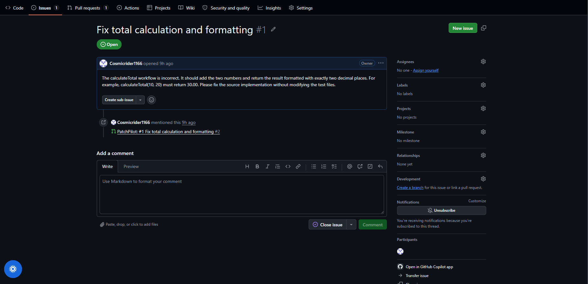
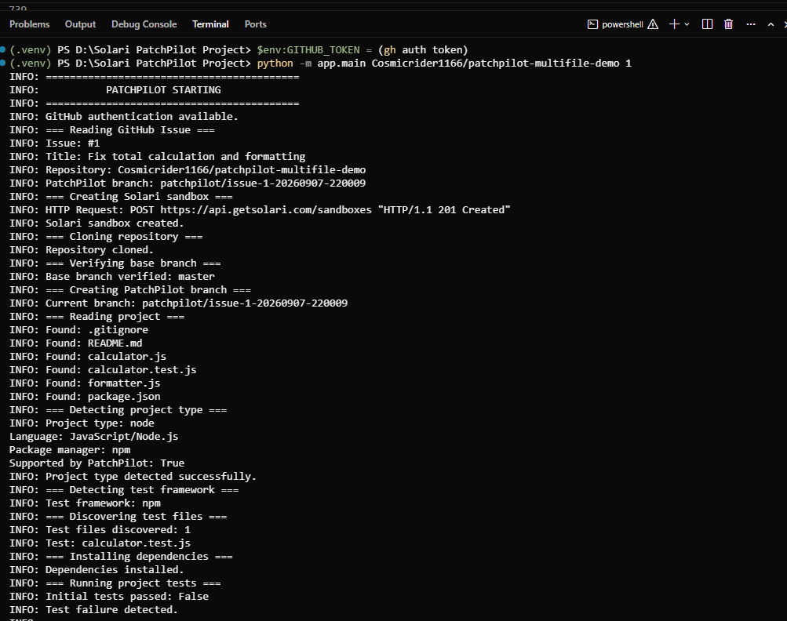
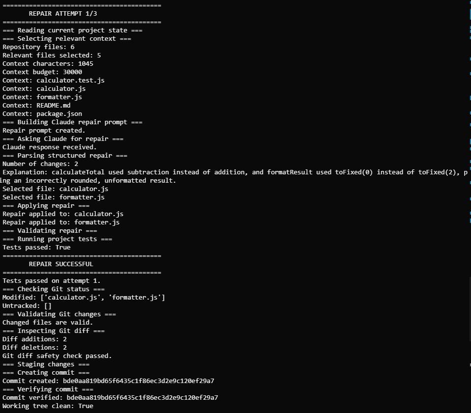
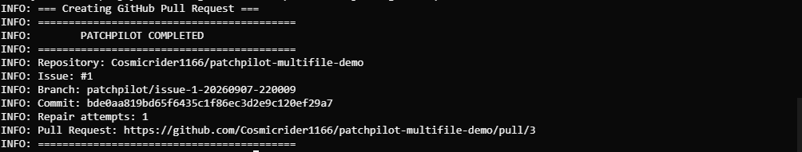

# PatchPilot End-to-End Demo

This document demonstrates a real end-to-end PatchPilot repair workflow using a deliberately broken Node.js project and a GitHub Issue.

PatchPilot autonomously investigates the issue, executes the project inside an isolated Solari sandbox, uses Claude Code to generate a repair, validates the repair with the project's tests, verifies the Git changes, and creates a GitHub Pull Request.

---

## Demo Repository

Repository:

`Cosmicrider1166/patchpilot-multifile-demo`

Issue:

`#1 — Fix total calculation and formatting`

Pull Request:

`#2 — Fix total calculation and formatting`

---

## The Problem

The demo repository contains a broken `calculateTotal` workflow.

The GitHub Issue specifies that:

- The calculation must add two numbers.
- The result must be formatted with exactly two decimal places.
- `calculateTotal(10, 20)` must return `30.00`.
- Test files must not be modified.

The repository intentionally contains incorrect source behavior.

### GitHub Issue



---

## PatchPilot Workflow

The complete workflow is:

```text
GitHub Issue
     │
     ▼
PatchPilot
     │
     ▼
Create isolated Solari sandbox
     │
     ▼
Clone repository
     │
     ▼
Verify base branch
     │
     ▼
Create unique repair branch
     │
     ▼
Detect project type
     │
     ▼
Detect test framework
     │
     ▼
Discover test files
     │
     ▼
Select relevant context
     │
     ▼
Install dependencies
     │
     ▼
Run tests
     │
     ▼
Claude Code investigation
     │
     ▼
Structured repair
     │
     ▼
Validate repair
     │
     ▼
Apply source changes
     │
     ▼
Run tests again
     │
     ▼
Tests pass
     │
     ▼
Validate Git diff
     │
     ▼
Commit
     │
     ▼
Push
     │
     ▼
Verify remote commit
     │
     ▼
Create Pull Request
```

---

## Step 1 — GitHub Issue

PatchPilot begins with a GitHub Issue describing the software problem.

The issue used in this demonstration is:

```text
Fix total calculation and formatting

The calculateTotal workflow is incorrect.

It should add the two numbers and return the result
formatted with exactly two decimal places.

For example:

calculateTotal(10, 20)

must return:

30.00

The source implementation should be fixed without
modifying the test files.
```

The issue provides the problem statement and expected behavior that PatchPilot passes into its repair workflow.

---

## Step 2 — Isolated Execution

PatchPilot creates an isolated Solari sandbox.

The target repository is cloned into the sandbox rather than being modified directly on the developer's machine.

The workflow then verifies that the repository is on the expected base branch before creating a dedicated repair branch.

The repair branch generated for this run was:

```text
patchpilot/issue-1-20260907-220009
```

### PatchPilot Startup and Project Detection



---

## Step 3 — Project Detection

PatchPilot analyzes the repository and detects the project type.

For this demonstration:

```text
Project:
Node.js

Package manager:
npm

Test framework:
npm
```

PatchPilot uses the detected project information to determine how dependencies should be installed and how the test suite should be executed.

---

## Step 4 — Initial Test Execution

Before asking Claude to modify the source code, PatchPilot runs the project's existing tests.

This establishes that the repository is currently failing and provides concrete failure information for the repair process.

The test result is then included in the context provided to Claude.

---

## Step 5 — Context Selection

PatchPilot does not blindly send the entire repository to Claude.

Instead, it selects relevant context using information such as:

- GitHub Issue content
- Test failures
- Test files
- Source files
- Project type
- Test framework
- Repository structure

The context is also bounded by configurable limits.

This keeps the AI prompt focused and prevents unnecessarily large repository dumps.

---

## Step 6 — Claude Code Investigation

Claude Code receives the issue, project information, relevant repository context, and test failure.

PatchPilot requires Claude to return a structured repair rather than arbitrary text.

The expected structure is:

```json
{
  "explanation": "Short explanation of the root cause",
  "changes": [
    {
      "file": "relative/path/to/source/file",
      "code": "complete corrected source code"
    }
  ]
}
```

Claude identifies the source files that need to change and provides complete corrected source code for those files.

---

## Step 7 — Repair Validation

PatchPilot validates the generated repair before applying it.

Validation includes:

- Structured response validation
- Required field validation
- Non-empty repair validation
- File-path validation
- Duplicate-file detection
- Test-file protection
- Generated-code size limits
- Semantic repair validation

The repair is rejected if it violates the safety rules.

---

## Step 8 — Multi-File Repair

This demonstration specifically verifies that PatchPilot can handle repairs involving multiple source files.

Claude selected the source files that required changes:

```text
calculator.js
formatter.js
```

The final repair changed:

```text
2 source files
```

PatchPilot did not allow arbitrary repository modifications.

Only the files expected by the repair were permitted to change.

### Claude Repair, Test Success, and Git Validation



---

## Step 9 — Test Verification

After applying the repair, PatchPilot runs the project's tests again.

The repaired project passes its tests.

The successful result is a critical part of the workflow:

```text
AI-generated repair
        ↓
Apply changes
        ↓
Run tests
        ↓
PASS
```

PatchPilot does not consider the repair successful merely because Claude generated code.

The repository itself must validate the result.

---

## Step 10 — Git Safety Validation

Before creating a commit, PatchPilot validates the resulting Git state.

The system checks that:

- Changes actually exist.
- Only expected files changed.
- Test files were not modified.
- The Git diff contains the expected repair files.

This provides an additional safety boundary between AI-generated code and the final Pull Request.

The successful run reported:

```text
Modified: ['calculator.js', 'formatter.js']
Untracked: []
Diff additions: 2
Diff deletions: 2
Git diff safety check passed.
```

---

## Step 11 — Commit

After the tests and Git safety checks pass, PatchPilot commits the repair.

The resulting commit was:

```text
bde0aa819bd65f6435c1f86ec3d2e9c120ef29a7
```

PatchPilot then verifies the local commit hash.

---

## Step 12 — Push

The repair branch is pushed to GitHub:

```text
patchpilot/issue-1-20260907-220009
```

PatchPilot also verifies that the remote branch points to the expected commit.

---

## Step 13 — Pull Request

PatchPilot creates a GitHub Pull Request from the repair branch into the repository's base branch.

The resulting Pull Request is:

```text
#3
```

### Final Pull Request Creation



The Pull Request contains the automated workflow summary, validation information, repair attempt count, and commit information.

---

## Final Result

The complete automated workflow successfully completed in:

```text
1 repair attempt
```

The final result was:

```text
GitHub Issue
     ↓
Solari sandbox
     ↓
Repository analysis
     ↓
Failing tests
     ↓
Claude investigation
     ↓
Structured repair
     ↓
2 source files changed
     ↓
Tests passed
     ↓
Git diff validation
     ↓
Commit
     ↓
Push
     ↓
Remote commit verification
     ↓
GitHub Pull Request
```

The final Pull Request created by this run was:

```text
https://github.com/Cosmicrider1166/patchpilot-multifile-demo/pull/3
```

---

## Why This Demo Matters

This demonstration validates several important PatchPilot capabilities together rather than testing them independently.

### Autonomous Issue-Driven Repair

The workflow starts from a GitHub Issue rather than a manually supplied code change.

### Isolated Execution

The repository is executed inside a Solari sandbox.

### AI-Assisted Debugging

Claude Code investigates the failing project and generates the repair.

### Structured AI Output

PatchPilot does not rely on unconstrained natural-language responses.

### Multi-File Modifications

The repair can safely involve more than one source file.

### Test-Based Verification

The generated repair must make the project's tests pass.

### Test Protection

PatchPilot prevents the AI repair from modifying test files.

### Git Safety

PatchPilot validates the resulting Git diff before committing.

### Commit Verification

PatchPilot verifies the commit produced by the repair.

### Remote Verification

PatchPilot verifies that the pushed branch points to the expected commit.

### Pull Request Automation

A successful repair results in a GitHub Pull Request ready for human review.

---

## Result

The demonstration shows PatchPilot operating as an autonomous software-maintenance pipeline:

```text
Issue
  ↓
Understand
  ↓
Investigate
  ↓
Repair
  ↓
Test
  ↓
Verify
  ↓
Commit
  ↓
Push
  ↓
Pull Request
```

The final Pull Request remains reviewable by a human developer.

PatchPilot therefore automates the repetitive repair workflow while retaining verification and safety boundaries around AI-generated code.
